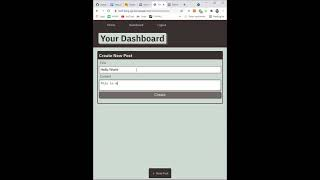

# E Commerce Backend

[](https://opensource.org/licenses/IPL-1.0)

<p>
    
    
    
    
    
    
    
</p>

## Table of Contents

- [**Description**](#-description)
- [**Installation**](#-installation)
- [**Usage**](#-usage)
- [**License**](#-license)
- [**Demo Video**](#-demo-video)
- [**Contributing**](#-contributing)
- [**Author**](#-author)

## 📑 Description

Come to my Tech Blog to interact with your teammates!

Visit the [**Deployed Link**](https://tech-blog-sjp.herokuapp.com/)!

## 💾 Installation

You would need to have the following **`npm`** packages for this app.

- **`mysql`**
- **`mysql2`**
- **`express`**
- **`sequelize`**
- **`dotenv`**
- **`bcrypt`**
- **`connect-session-sequelize`**

You already have all the packages in your **`package.json`**?  
Then just type **`npm i`** in your terminal.

## 💻 Usage

Once you **`git clone`** this repository, make sure you create **`.env`** file in your cloned directory, and have following codes in your **`.env`**.

```
DB_NAME=
DB_USER=
DB_PW=
```

**Notes**

- **`DB_NAME`**: the name of the database in **`./db/schema.sql`**
- **`DB_USER`**: the root user of your **`MySQL`** Database.
- **`DB_PW`**: the password of your **`MySQL`** Account.

Finished all the steps above?  
Type and run the following command in your terminal.

- **`npm start`**

## 🛠 License

This application is covered by the **ISC** license.

## 🎬 Demo Video

If you want to watch the demo video for how to use the application, check out the video below.

**CLICK THE IMAGE BELOW**  
[](https://youtu.be/pOPo6p_6IyU)

## 🔥 Contributing

**Israel Magallon**

- Portfolio: [**Portfolio**](https://imagallon.github.io/portfolio1.1/) (to be updated)
- Email: **izzymagallonworks@gmail.com**
- **Github**: [**imagallon**](https://github.com/imagallon)

**Vivianna Cowan**

- Portfolio: [**Portfolio**](https://vivicowan.github.io/updated-portfolio/) (to be updated)
- Email: **vivicare@gmail.com**
- **Github**: [**vivicowan**](https://github.com/vivicowan)

## 😎 Author

🖐 If you have any question about me or my project, feel free to contact me!

- **Jun Park**
  - Portfolio: [**Portfolio**](https://zzangu0215.github.io/portfolio/) (to be updated)
  - Email: **tajo0215@gmail.com**
  - **Github**: [**zzangu0215**](https://github.com/zzangu0215)
  - [**Instagram**](https://www.instagram.com/o0ojunny/)
